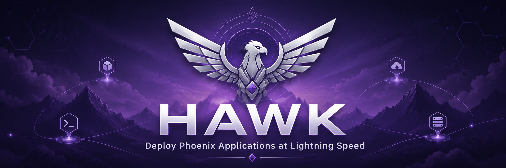

# HAWK Landing Page



Professional static landing page for [HAWK](https://github.com/Null-logic-0/hawk), a zero-dependency CLI for deploying Phoenix applications with Bash and SSH.

This site presents the project, explains the deployment workflow, highlights core features, and gives developers a clean path from discovery to installation.

## Project Link

Main HAWK repository:

[github.com/Null-logic-0/hawk](https://github.com/Null-logic-0/hawk)

## Overview

HAWK is built for Phoenix developers who want a deployment tool that stays understandable and close to the system. If a server has Bash, SSH, Git, and a standard Linux environment, HAWK can deploy without requiring Ruby, PHP, Python, or a heavy runtime stack.

The landing page communicates that same philosophy:

- simple static architecture
- fast loading
- no build step
- no framework lock-in
- readable source code
- easy deployment to any static host

## Features Presented

- Phoenix-focused deployment workflow
- Bash and SSH based runtime model
- Capistrano-style release directories
- Atomic symlink switching
- zero-downtime deployment messaging
- rollback support
- logs, status, and health-check command examples
- open-source and MIT license positioning

## Folder Structure

```text
hawk_website/
├── index.html
├── assets/
│   ├── images/
│   ├── icons/
│   └── fonts/
├── styles/
│   ├── main.css
│   ├── variables.css
│   ├── reset.css
│   ├── layout.css
│   ├── components.css
│   ├── sections.css
│   ├── animations.css
│   └── responsive.css
└── js/
    ├── main.js
    ├── navigation.js
    ├── terminal.js
    ├── tabs.js
    ├── animations.js
    ├── clipboard.js
    └── utils.js
```

## Why HTML, CSS, and JavaScript

This landing page intentionally uses plain HTML, CSS, and JavaScript instead of a frontend framework or UI library.

For this project, that choice is practical rather than nostalgic:

- **The page is mostly content and presentation.** A framework would add complexity without solving a real product problem.
- **Performance stays predictable.** There is no hydration cost, client-side routing layer, or bundled runtime.
- **The source remains easy to audit.** Anyone can open the files and understand how the page works.
- **Deployment is simpler.** The site can be served from GitHub Pages, Netlify, Vercel, a VPS, Nginx, or any static file host.
- **Maintenance is lower.** There are no package updates, build tools, dependency chains, or breaking framework changes.
- **It matches HAWK's philosophy.** HAWK favors clear, inspectable tooling over unnecessary runtime dependencies.

Libraries and frameworks are valuable when an application needs state management, routing, complex component composition, server rendering, or a larger design system. This site does not need those things. Keeping it static makes the landing page faster, easier to maintain, and more aligned with the product's identity.

## Running Locally

Because the JavaScript is split into ES modules, use a local static server instead of opening the file directly:

```bash
python3 -m http.server 8027
```

Then open:

```text
http://127.0.0.1:8027/
```

## Editing Notes

- Global tokens live in `styles/variables.css`.
- Cross-page layout and background structure live in `styles/layout.css`.
- Reusable UI pieces live in `styles/components.css`.
- Page-specific sections live in `styles/sections.css`.
- Keyframes and reveal animation classes live in `styles/animations.css`.
- Media queries live in `styles/responsive.css`.
- JavaScript behavior is split by feature in the `js/` directory.

## License

This landing page is released under the MIT License. See [LICENSE](./LICENSE).
